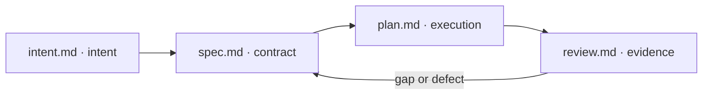

# duumbi-flow

**Make it Work → Make it Right → Make it Fast.** An engineering methodology and small, standalone Agent Skills for evidence-backed outcomes.

> Initial package intended for a pilot. Structural checks do not establish skill effectiveness in real development.

All repository content is maintained in English. Translate during conversations when needed; do not maintain translated copies in this repository.

## Start here

- [Methodology](docs/methodology.md): value, maturity, and user exposure.
- [Workflow and file conventions](docs/workflow.md): how four work steps relate to three quality levels.
- [Installation](docs/installation.md): skills can be used independently.
- [Worked example](examples/export-filtered-list/intent.md): four documents for a narrow feature slice.
- [Pilot](docs/pilot.md): how to establish whether the method helps.
- [GitHub implementation proposal](docs/github.md): records, Projects, CI, and releases.

## Distinct concepts

| Work step | Output | Question |
| --- | --- | --- |
| plan | `intent.md` | What do we want to achieve, and why? |
| design | `spec.md` | What behavior and constraints do we commit to? |
| build | `plan.md` + implementation | How will we build and verify it? |
| review | `review.md` | What does the evidence establish, and what is missing? |

**WORK / RIGHT / FAST** describe the development focus; **M1 / M2 / M3** describe verified maturity. They are not branch names and do not map directly to the work steps above.

## Skills

| Skill | When to use it |
| --- | --- |
| [duumbi-plan](skills/duumbi-plan/SKILL.md) | Clarify the scope and success criteria of a development idea. |
| [duumbi-design](skills/duumbi-design/SKILL.md) | Define acceptance examples and the technical contract. |
| [duumbi-build](skills/duumbi-build/SKILL.md) | Prepare an execution plan and perform requested implementation with verification proportional to risk. |
| [duumbi-review](skills/duumbi-review/SKILL.md) | Review sources, diffs, and actual verification evidence. |
| [knowledge-base](skills/knowledge-base/SKILL.md) | Search a knowledge base and, when requested, maintain it using traceable sources. |

Clients that support it can invoke a skill as `$skill-name`; other clients may provide their own invocation mechanism. No skill requires the others, an external subscription, or a particular issue tracker. Templates live in each skill's own `assets/` directory.

## Limitations

This repository provides guidance and document templates. It does not run releases, configure branch protection, or enforce product CI/CD gates by itself. The user's request and the target project's rules determine the scope of execution.

## Contributing and license

[CONTRIBUTING.md](CONTRIBUTING.md) · [MIT](LICENSE) · [References](docs/references.md)
