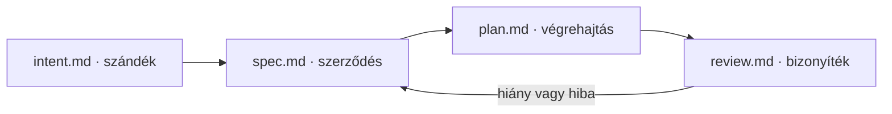

# duumbi-flow

**Make it Work → Make it Right → Make it Fast.** Magyar fejlesztési módszertan és kis, önálló Agent Skills a bizonyítható eredményhez.

> Kezdeti, pilotra szánt csomag. A szerkezeti ellenőrzés nem bizonyítja a skillek hatékonyságát valós fejlesztésben.

## Kezdd itt

- [Módszertan](docs/methodology.hu.md): érték, érettség és felhasználói elérhetőség.
- [Munkafolyamat és fájlnevek](docs/workflow.hu.md): hogyan kapcsolódik a négy munkalépés a három minőségi szinthez.
- [Telepítés](docs/installation.hu.md): a skillek külön is használhatók.
- [Kidolgozott példa](examples/export-filtered-list/intent.md): egy szűk funkció négy dokumentuma.
- [Pilot](docs/pilot.hu.md): mi igazolja, hogy a módszer segít.
- [GitHub-megvalósítási javaslat](docs/github.hu.md): nyilvántartás, Project, CI és kiadás.

## Két külön fogalom

| Munkalépés | Kimenet | Kérdés |
| --- | --- | --- |
| plan | `intent.md` | Mit akarunk elérni, és miért? |
| design | `spec.md` | Milyen viselkedést és korlátokat vállalunk? |
| build | `plan.md` + megvalósítás | Hogyan készítjük el és ellenőrizzük? |
| review | `review.md` | Mit igazolnak a bizonyítékok, és mi hiányzik? |

**WORK / RIGHT / FAST** a fejlesztés fókusza; **M1 / M2 / M3** az igazolt érettség. Ezek nem branchnevek, és nem egyeznek meg a fenti munkalépésekkel.

## Skillek

| Skill | Mikor használd? |
| --- | --- |
| [duumbi-plan](skills/duumbi-plan/SKILL.md) | Egy fejlesztési elképzelés hatókörének és sikerfeltételeinek tisztázásához. |
| [duumbi-design](skills/duumbi-design/SKILL.md) | Az elfogadási példák és a műszaki szerződés kidolgozásához. |
| [duumbi-build](skills/duumbi-build/SKILL.md) | Végrehajtási tervhez és a kért megvalósításhoz, kockázatarányos ellenőrzéssel. |
| [duumbi-review](skills/duumbi-review/SKILL.md) | Forrásra, diffre és tényleges ellenőrzésekre épülő felülvizsgálathoz. |
| [knowledge-base](skills/knowledge-base/SKILL.md) | Tudástár kereséséhez, és kérésre forrásalapú bővítéséhez. |

A `$skill-name` hivatkozás az ezt támogató kliensekben használható; más kliensek saját meghívási módot adhatnak. Egyik skill sem igényli a többi telepítését, külső előfizetést vagy konkrét issue trackert. A sablonok a skill saját `assets/` mappájában vannak.

## Korlátok

A repo útmutatást és dokumentumsablonokat ad. Nem futtat kiadást, nem állít be branchvédelmet, és nem biztosít önmagában CI/CD enforcementet. A felhasználó utasítása és a célprojekt szabályai határozzák meg a végrehajtás hatókörét.

## Hozzájárulás és licenc

[CONTRIBUTING.md](CONTRIBUTING.md) · [MIT](LICENSE) · [Inspirációk](docs/references.hu.md)
