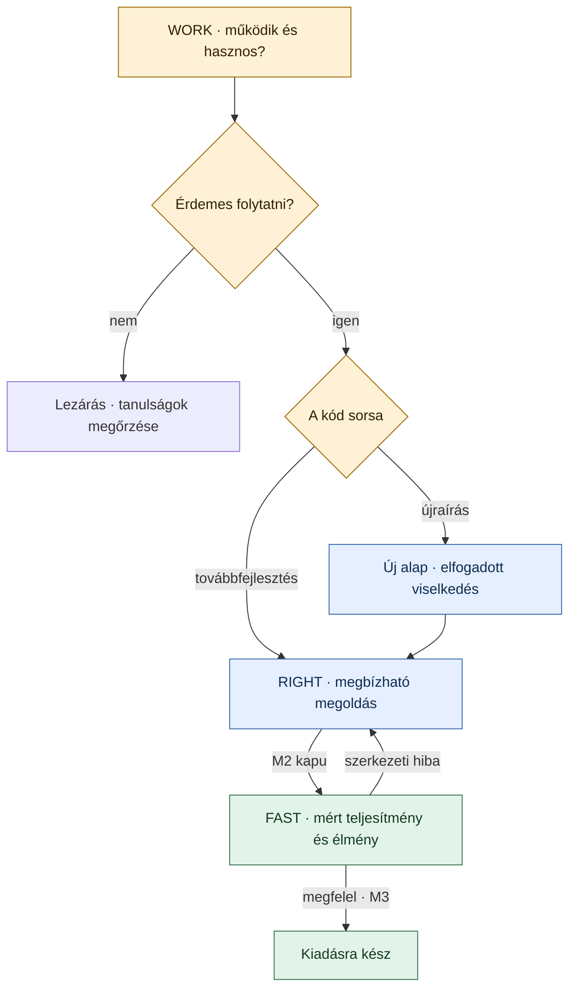
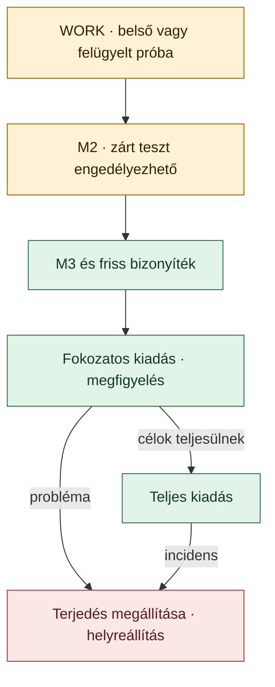
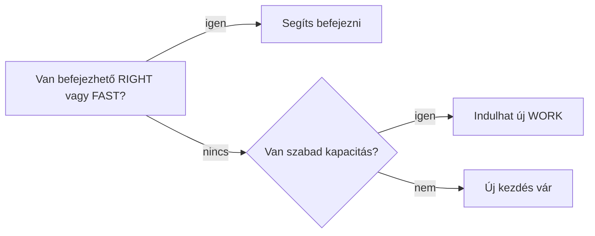

# Make it Work Make it Right Make it Fast

**Általános fejlesztési módszertan · v1.2 · 2026. október 5.**

**Először igazoljuk az értéket, majd a megbízhatóságot, végül a mért teljesítményt és felhasználói élményt.** Kis, önállóan értékelhető funkciószeletekkel dolgozunk. Ugyanaz a felelős viszi végig a szeletet a döntéstől a kiadásig.

A módszer egyéni és csapatmunkára, AI-támogatással is használható. Ez az alapmodell; a konkrét eszközök és termékszabályok külön projektbeállítások. **A v1.2 az előző változatot felváltó, pilotra javasolt kiadás.**

## A folyamat egy ábrán

A WORK végén két külön döntés születik: **megtartjuk-e az ötletet**, és **mi történjen a kóddal**. A kódsors: eldobás (*discard*), továbbfejlesztés (*evolve*) vagy újraírás (*rewrite*). Az elfogadott ötlet kódja is eldobható; ilyenkor a megvalósítás újraírással folytatódik. Az elfogadási példák és a tanulságok megmaradnak.

## Három külön állapot

| Kérdés | Nyilvántartott állapot |
| --- | --- |
| **Van értéke?** | Nyitott → elfogadott vagy elvetett |
| **Mennyire igazolt a megvalósítás?** | Nem igazolt → M1 → M2 → M3 |
| **Kik használhatják?** | Belső → felügyelt próba → zárt teszt → fokozatos → teljes kiadás |

A táblán látható **munkaszakasz számított nézet**, nem kézzel átállítható minőségi címke: elvetett ötlet → lezárt; nyitott értékdöntés → WORK; elfogadott ötlet M2 alatt → RIGHT; M2 → FAST; M3 → kiadásra kész. M2/M3 csak elfogadott értékdöntés mellett érvényes. A várakozás, blokkolás és lejárat külön jelölés.

**Példa:** az ötlet elfogadott, a kód M2, a felhasználók köre zárt teszt. A munkaszakasz FAST.

**Újraíráskor** az értékdöntés megmarad, az új implementáció érettsége „nem igazolt”; a munka RIGHT-ban folytatódik, az összes korábbi kapufeltétel ellenőrzésével.

**Elavult bizonyíték és hiba különbözik.** Új build vagy érintett komponens változása után az ellenőrzések frissítendők; addig nem bővülhet a felhasználók köre. Ez önmagában nem törli a korábban elért szintet. Sikertelen újraellenőrzéskor a még bizonyított szint marad: M3-hiba mellett lehet M2, M2-hiba mellett M1; az M1 minimumának sérülésekor „nem igazolt”. A veszélyes használatot azonnal korlátozzuk.

## A három minőségi kapu

| Szakasz | Cél | Kilépési bizonyíték |
| --- | --- | --- |
| **WORK → M1** | A megoldás működik, az értéke megítélhető. | Build és statikus ellenőrzések; biztonsági minimum; legalább egy valódi eredményt ellenőrző automatizált happy-path smoke/E2E teszt; felhasználói próba és értékdöntés; korai architekturális és teljesítményellenőrzés; kódsors, felelős, határidő. |
| **RIGHT → M2** | A megoldás helyes, karbantartható és üzemeltethető. | Kockázathoz igazított tesztek, negatív és hibautak; review; biztonsági és adatvédelmi ellenőrzés; használhatósági és akadálymentességi alapszint; diagnosztika; kipróbált migráció és helyreállítás, ahol releváns. |
| **FAST → M3** | A megoldás teljesíti az előre vállalt célokat. | Reprezentatív környezetben mért teljesítmény és felhasználói élmény; szükséges terhelési és mély biztonsági vizsgálatok; a kiadásra jelölt buildhez kötött bizonyíték; kipróbált leállítás vagy helyreállítás. |

A kapuk egymásra épülnek; a meglévő működés regressziós ellenőrzése minden szinten megmarad. A teszt valódi kimenetet vizsgáljon: például a létrehozott rekord helyesen visszaolvasható. Az alkalmazás elindulása önmagában kevés.

**FAST-ban nem kötelező optimalizálni.** Ha a célok már teljesülnek, a mérés elegendő. Ha nem: célzott javítás és újramérés; szerkezeti hibánál visszalépés RIGHT-ba; vagy lezárás. Célérték csak a termékfelelős indokolt, naplózott döntésével változhat, az eredeti érték megőrzésével.

## Ami már az első naptól kötelező

Minden projekt meghatározza a **nem sérthető alapkövetelményeit**: például adatmegőrzés, hozzáférési határok, engedélyezett adatáramlás. Ezek prototípusban sem lazíthatók. Módosításuk külön döntést és kockázatértékelést igényel; ahol lehet, gépi ellenőrzés védi őket.

- **Biztonság és adatvédelem:** WORK-ban elkülönített környezet, minimális jogosultság, titok- és függőségellenőrzés, korlátozott bemenetek. RIGHT-ban jogosultsági tesztek, adatleltár és fenyegetéselemzés. FAST-ban a kockázat által indokolt mély vizsgálatok. Az ismert veszély vizsgálatát előrehozzuk. Ez illeszkedik az SDLC-be integrált biztonság elvéhez. [NIST SSDF](https://csrc.nist.gov/pubs/sp/800/218/final)

- **Teljesítmény:** induláskor rögzítjük a várható terhelést, adatméretet, célkörnyezetet és kereteket. A megkérdőjelezhető architektúrát már WORK-ban célzott méréssel ellenőrizzük.

- **Felhasználói élmény:** WORK-ban valódi felhasználói visszajelzés, RIGHT-ban használhatósági és akadálymentességi minimum, FAST-ban mérhető élménycél. Például segítség nélküli feladatteljesítés, válaszidő vagy hibás próbálkozások aránya. A megfigyeléshez szükséges adatkezelést előre tisztázzuk.

A biztonsági minimum nem halasztható M3-ig. Kihasználható kritikus vagy magas kockázat mellett nincs felhasználói kiadás.

## Egy trunk és rövid változtatások

**Alapértelmezés: egy termék repositoryja, egy `main`, rövid életű fejlesztési branchek.** A WORK/RIGHT/FAST funkcióállapot; nem három branch és nem három repo. A kis változtatások gyakori integrációját a DORA is támogatja. [DORA](https://dora.dev/capabilities/trunk-based-development/)

A három fázisbranch párhuzamos kódváltozatokat és visszavezetendő javításokat termelne. Három fázisrepo ehhez külön adminisztrációt adna. Külön repo indoka lehet önálló termék, jogosultsági vagy infrastruktúrahatár.

**WORK alapból sandboxban indul.** A kísérletből a tudást és az indokolt kódrészeket visszük tovább kis, ellenőrzött PR-okban; a teljes sandboxot nem emeljük át automatikusan. Kis, izolált szelet közvetlenül trunkon is fejlődhet kapcsoló mögött, ha bizonyítottan nem veszélyezteti a meglévő működést.

A `main` a támogatott konfigurációval kiadható marad. A kapcsoló nem véd a közös adatbázis-, függőség- vagy indulási hibáktól. A feature flagek szétválasztják a kód integrálását és bekapcsolását, de tesztelési és takarítási költségük van. [Feature Toggles](https://martinfowler.com/articles/feature-toggles.html)

## A felhasználók köre külön döntés

A szint csak **jogosultságot ad a következő döntéshez**. A zárt teszt és a kiadás külön felelőst, biztonságos használati kört és megállítási feltételt igényel. M1-kóddal felügyelt próba csak izolált környezetben tartható; a „zárt teszt” nem felmentés a kockázatok alól.

| Termékforma | Elérhetőség szabályozása | Helyreállítás |
| --- | --- | --- |
| **Központilag üzemeltetett rendszer** | Ellenőrzött szerveroldali kapcsoló; az ON/OFF út is tesztelt. | Kikapcsolás, kompatibilis előző build vagy javító kiadás. |
| **Telepített kliens vagy eszköz** | Build- és kiadási csatornák; szükség esetén a nem megfelelő érettségű kód kihagyása a csomagból. | Terjesztés megállítása, elérhető vészkapcsoló, javító verzió. Nem feltételezünk azonnali visszaállítást minden eszközön. |

A buildbe bekerülés és a használat engedélyezése külön korlát. A kiadási profil rögzíti mindkettőt. Vészkapcsolónál az offline viselkedést is meghatározzuk. A kikapcsolás nem vonja vissza a korábbi adatírásokat; migrációhoz kompatibilitási és helyreállítási terv kell.

**Hotfix:** először csökkentjük a kárt, majd a ténylegesen érintett kiadásból kiindulva javítunk. Kötelező a hibát reprodukáló teszt, az érintett ellenőrzés és review; a javítás visszakerül a trunkba. A kihagyott hosszú vizsgálatok pótlása legkésőbb a következő munkanapon felelőst és határidőt kap.

## A munka méretéhez igazított ellenőrzés

| Munkatípus | Útvonal |
| --- | --- |
| **Technikai kísérlet** | Előre rögzített kérdés, időkeret és folytatjuk/leállítjuk döntés; izolált eredmény. |
| **Új funkciószelet** | WORK → RIGHT → FAST. |
| **Viselkedést nem módosító változás** | Integráció, érintett regressziók és alapkövetelmények ellenőrzése. |
| **Hibajavítás** | Reprodukáló teszt és az érintett komponens minőségi kapuja. |
| **Sürgős hibajavítás** | Hotfix-útvonal, a többi munka elé sorolva. |

Ha egy változtatás új viselkedést vezet be, funkciószeletként kezeljük. A rövidített út nem engedheti meg a már kiadott minőség romlását.

**Kockázat:** alacsony az izolált, visszafordítható változás; közepes a szokásos funkciófejlesztés; magas az érzékeny adatot, jogosultságot, pénzmozgást, közös infrastruktúrát vagy nehezen visszafordítható adatváltozást érintő munka. Ismeretlen besorolást tisztázásig magasként kezelünk. A besorolást review ellenőrzi.

Alacsony kockázatnál az M3 lehet rövid, indokolt relevanciavizsgálat és regresszióellenőrzés. Magas kockázatnál korai döntési jegyzet és mélyebb ellenőrzés kell. Több érintett komponensnél az összes vonatkozó követelmény érvényes.

## Kevesebb elkezdett munka és kötelező lejárat

**Előbb fejezzünk be, utána kezdjünk újat.** Új WORK csak akkor indul, ha van stabilizálási és ellenőrzési kapacitás. RIGHT- vagy FAST-torlódásnál a csapat és az agentek a meglévő munkát segítik.

**Kezdő pilotbeállítások, nem univerzális normák:**

- Egy fejlesztőnél **egy aktív tétel**. Külső várakozáskor legfeljebb egy második nyitható; a várakozó is beleszámít a nyitott munkába. Csapatnál a limitet a tényleges ellenőrzési kapacitás adja.

- Legfeljebb **egy sürgős hotfix**, szükség esetén a többi munka megállításával.

- **10 munkanap az első WORK-naptól M2-ig vagy lezárásig.** A várakozás és újraírás nem indít új órát. Figyelmeztetés két munkanappal előtte; egyszer legfeljebb öt munkanapos, indokolt hosszabbítás.

- Lejáratkor a prototípus használata leáll, új funkcióbővítés blokkolt. Stabilizálás és eltávolítás folytatható; a feladat a rendezésig WIP marad.

## Bizonyíték és felelősség

A termékfelelős dönt az értékről és a célokról; a technikai felelős a kapukról; a kiadási felelős a felhasználói elérhetőségről. Ezeket egy ember is betöltheti, de a döntéseket névvel és dátummal rögzíteni kell.

Bizonyíték a tesztfutás, buildazonosító, mérési jegyzőkönyv vagy felhasználói megfigyelés. Az AI állítása önmagában nem az. Az AI-review kiegészítő ellenőrzés; más modell használata sem bizonyít függetlenséget. Egyszemélyes munkánál az önjóváhagyás kockázatát láthatóvá tesszük; magas kockázathoz megfelelő szakértői ellenőrzést szervezünk.

**Egy szelethez egy rövid adatlap elég:** cél és elfogadási példa; munkatípus és kockázat; felelős és lejárat; értékdöntés, érettség, elérhetőség; kódsors; mérési célok; bizonyítékok; helyreállítás.

Az eszközréteg ezt érvényesíti: verziózott nyilvántartás, védett review, kötelező CI-kapuk és külön kiadási engedély. A munkatábla ezek nézete; egy címke átállítása nem pótolja a bizonyítékot. GitHub, más platform vagy konkrét AI-szolgáltatás kiválasztása külön megvalósítási döntés.

## Bevezetés kis pilotban

**Javaslat:** 4–8 hét, 2–3 kis funkciószelet, a végén folytatás/módosítás/leállítás döntés. Ha a megvalósíthatóság kérdéses, technikai kísérlettel kezdünk. A pilot elérési célját előre választjuk meg: zárt teszt vagy fokozatos éles kiadás.

Mérjük az átfutást a választott célig, a várakozást, a kapuk munkaigényét, a lejárásokat, a célérték-módosításokat és a kapun átjutott hibákat. A továbbfejlesztés/újraírás/eldobás arány tanulási jel, nem teljesítménycél.

A módszer akkor vihető tovább, ha a kritikus alapkövetelmények megmaradtak, nincs gazdátlan prototípus, a kiadások bizonyítékai visszakereshetők, és az ellenőrzés költsége vállalható. Kis mintából nem állítunk bizonyított termelékenységnövekedést.

**Indulás előtt öt döntés kell:** alapkövetelmények; kockázati besorolás; célkörnyezet és mérési célok; kiadási/helyreállítási lehetőségek; felelősök és kapacitás.

## Forrás és alkalmazás

Ez a módszertan v1.2 változata. A repository fájlkonvencióit és a kiadás utáni visszanézést a [munkafolyamat](workflow.hu.md) egészíti ki. [Inspirációk](references.hu.md).
