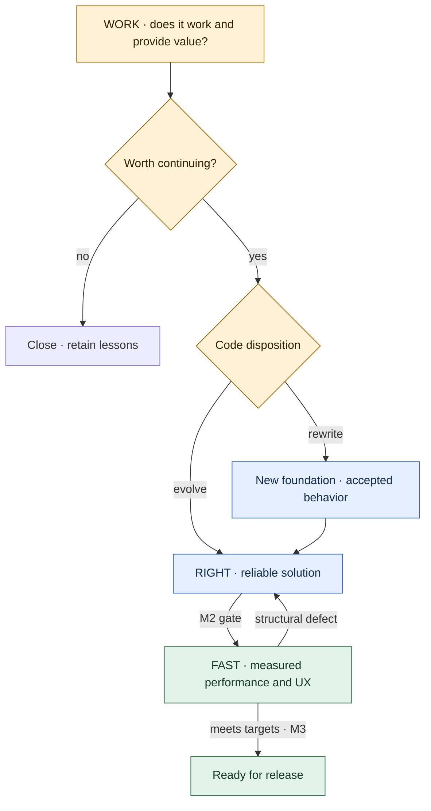
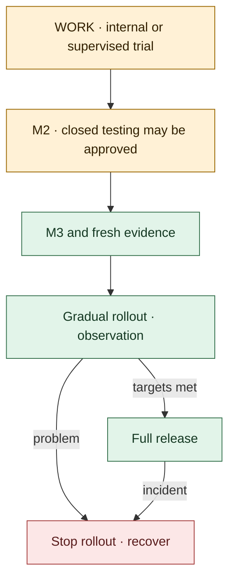
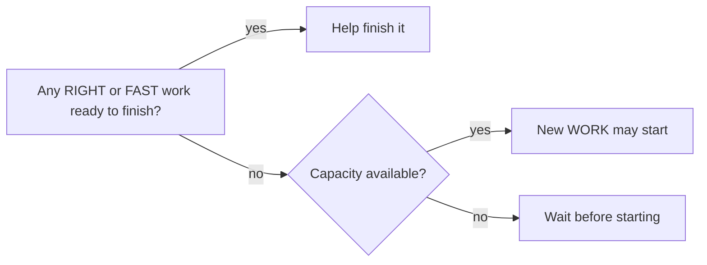

# Make it Work Make it Right Make it Fast

**General engineering methodology · v1.2 · October 5, 2026**

**First establish value, then reliability, then measured performance and user experience.** Work in small, independently evaluable feature slices. The same owner takes a slice from the initial decision through release.

The method supports individual and team development, including AI assistance. This is the core model; specific tools and product rules are separate project settings. **Version 1.2 supersedes the previous version and is recommended for a pilot.**

## The process at a glance

WORK ends with two separate decisions: **whether to retain the idea** and **what happens to the code**. Code disposition is *discard*, *evolve*, or *rewrite*. Code for an accepted idea may still be discarded; implementation then continues through a rewrite. Preserve acceptance examples and lessons learned.

## Three separate states

| Question | Recorded state |
| --- | --- |
| **Does it provide value?** | Open → accepted or rejected |
| **How well is the implementation verified?** | Unverified → M1 → M2 → M3 |
| **Who may use it?** | Internal → supervised trial → closed testing → gradual rollout → full release |

The board's **work stage is a calculated view**, not a quality label that can be changed manually: rejected idea → closed; open value decision → WORK; accepted idea below M2 → RIGHT; M2 → FAST; M3 → ready for release. M2/M3 are valid only with an accepted value decision. Waiting, blocked status, and expiry are separate indicators.

**Example:** the idea is accepted, the code is M2, and user exposure is closed testing. The work stage is FAST.

**On a rewrite**, retain the value decision, but reset the new implementation's maturity to “unverified.” Work continues in RIGHT, rechecking every earlier gate requirement.

**Stale evidence differs from failure.** After a new build or a change to an affected component, refresh the checks; do not expand user exposure in the meantime. This alone does not erase the previously achieved level. If revalidation fails, retain only the level still supported by evidence: an M3 failure may leave M2; an M2 failure may leave M1; violating the M1 minimum leaves “unverified.” Restrict hazardous use immediately.

## The three quality gates

| Stage | Goal | Exit evidence |
| --- | --- | --- |
| **WORK → M1** | The solution works and its value can be assessed. | Build and static checks; security baseline; at least one automated happy-path smoke/E2E test checking a real outcome; user trial and value decision; early architecture and performance checks; code disposition, owner, and deadline. |
| **RIGHT → M2** | The solution is correct, maintainable, and operable. | Tests proportional to risk, including negative and failure paths; review; security and privacy checks; usability and accessibility baseline; diagnostics; tested migration and recovery where relevant. |
| **FAST → M3** | The solution meets its predefined targets. | Performance and UX measured in a representative environment; required load and deep security tests; evidence tied to the release candidate build; tested shutdown or recovery. |

The gates are cumulative; regression checks for existing behavior remain at every level. Tests must inspect real output, such as successfully reading back a newly created record. Starting the application is insufficient on its own.

**Optimization is not mandatory in FAST.** If the targets are already met, measurement is sufficient. Otherwise, make a targeted improvement and measure again; return to RIGHT for structural defects; or close the work. Only a justified, recorded decision by the product owner can change a target, preserving its original value.

## Requirements from day one

Every project defines its **invariants**, such as data preservation, access boundaries, and allowed data flows. These cannot be relaxed even in a prototype. Changing them requires a separate decision and risk assessment; automate their verification where possible.

- **Security and privacy:** WORK uses an isolated environment, least privilege, secret and dependency checks, and constrained inputs. RIGHT adds authorization tests, a data inventory, and threat modeling. FAST adds deep testing justified by risk. Investigate known hazards earlier. This aligns with integrating security into the SDLC. [NIST SSDF](https://csrc.nist.gov/pubs/sp/800/218/final)

- **Performance:** define expected load, data volume, target environment, and budgets at the start. Test questionable architectural assumptions with focused measurements during WORK.

- **User experience:** obtain real user feedback in WORK, establish a usability and accessibility baseline in RIGHT, and measure UX targets in FAST. Examples include unassisted task completion, response time, and failed-attempt rate. Clarify the data handling needed for observation in advance.

The security baseline cannot wait until M3. Do not release to users with exploitable critical or high risks.

## One trunk and small changes

**Default: one product repository, one `main`, and short-lived development branches.** WORK/RIGHT/FAST describe feature states, not three branches or repositories. DORA also supports frequent integration of small changes. [DORA](https://dora.dev/capabilities/trunk-based-development/)

Three phase branches would create parallel code versions and fixes that must be propagated between them. Three phase repositories would add administration on top. Separate repositories may be justified by independent products, access boundaries, or infrastructure boundaries.

**WORK starts in a sandbox by default.** Carry forward knowledge and justified code portions through small, verified PRs; do not automatically promote the entire sandbox. A small, isolated slice can also develop directly on trunk behind a flag when evidence shows it does not endanger existing behavior.

`main` remains releasable in its supported configuration. A flag does not protect against shared database, dependency, or startup failures. Feature flags separate code integration from enablement, but introduce testing and cleanup costs. [Feature Toggles](https://martinfowler.com/articles/feature-toggles.html)

## User exposure is a separate decision

A maturity level only **establishes eligibility for the next decision**. Closed testing and release each require an owner, a safe usage scope, and a stop condition. Supervised trials with M1 code must remain in an isolated environment; “closed testing” does not waive risk controls.

| Product form | Exposure control | Recovery |
| --- | --- | --- |
| **Centrally operated system** | A verified server-side flag; both ON and OFF paths tested. | Disable, restore a compatible previous build, or ship a corrective release. |
| **Installed client or device** | Build and release channels; exclude insufficiently mature code from the package when necessary. | Stop distribution, use an available kill switch, or ship a corrective version. Do not assume immediate rollback on every device. |

Inclusion in a build and permission to use a feature are separate constraints. The release profile records both. Define offline behavior for kill switches. Disabling a feature does not undo previous writes; migrations require a compatibility and recovery plan.

**Hotfix:** reduce harm first, then fix from the release actually affected. Require a reproducing test, relevant checks, and review; bring the fix back to trunk. Assign an owner and deadline for omitted long-running checks by the next business day at the latest.

## Verification proportional to the work

| Work type | Route |
| --- | --- |
| **Technical experiment** | A predefined question, timebox, and continue/stop decision; isolated output. |
| **New feature slice** | WORK → RIGHT → FAST. |
| **Change without behavioral impact** | Integration, affected regressions, and invariant checks. |
| **Bug fix** | A reproducing test and the affected component's quality gate. |
| **Urgent bug fix** | The hotfix route, ahead of other work. |

Treat a change that introduces new behavior as a feature slice. A shortened route must not lower the quality already released.

**Risk:** low for isolated, reversible changes; medium for ordinary feature development; high for sensitive data, permissions, money movement, shared infrastructure, or data changes that are hard to reverse. Treat an unknown classification as high until clarified. Review verifies the classification.

At low risk, M3 can be a brief, justified relevance assessment and regression check. High risk requires an early decision record and deeper verification. When multiple components are affected, all applicable requirements apply.

## Limit work in progress and enforce expiry

**Finish before starting more.** Start new WORK only when stabilization and verification capacity is available. If RIGHT or FAST becomes a bottleneck, the team and agents help finish existing work.

**Initial pilot settings, not universal standards:**

- **One active item per developer.** During an external wait, at most one second item may be opened; the waiting item still counts as open work. A team's limit follows its actual verification capacity.

- At most **one urgent hotfix**, pausing other work if necessary.

- **10 business days from the first WORK day to M2 or closure.** Waiting and rewrites do not reset the clock. Warn two business days before expiry; allow one justified extension of at most five business days.

- At expiry, stop prototype use and block new feature expansion. Stabilization and removal may continue; the item remains WIP until resolved.

## Evidence and accountability

The product owner decides value and targets; the technical owner decides gates; the release owner decides user exposure. One person may hold these roles, but decisions must be recorded with a name and date.

Evidence includes test runs, build identifiers, measurement reports, and user observations. An AI assertion alone is not evidence. AI review is supplementary; using a different model does not establish independence. Make the risk of self-approval visible in solo work; arrange appropriate expert review for high-risk work.

**One brief record per slice is enough:** goal and acceptance example; work type and risk; owner and expiry; value decision, maturity, and user exposure; code disposition; measurement targets; evidence; recovery.

The tooling layer enforces this through versioned records, protected review, required CI gates, and separate release authorization. The work board is a view of those records; changing a label does not replace evidence. Choosing GitHub, another platform, or a specific AI service is a separate implementation decision.

## Introduce it through a small pilot

**Proposal:** 4–8 weeks, 2–3 small feature slices, followed by a continue/change/stop decision. Start with a technical experiment when feasibility is uncertain. Choose the pilot's exposure target in advance: closed testing or a gradual production rollout.

Measure lead time to the chosen target, waiting time, gate effort, expirations, target changes, and defects that escaped the gates. Evolve/rewrite/discard ratios are learning signals, not performance targets.

Continue with the method if critical invariants were preserved, no prototype lacks an owner, release evidence is traceable, and verification overhead is acceptable. Do not claim proven productivity gains from a small sample.

**Make five decisions before starting:** invariants; risk classification; target environment and measurement goals; release and recovery options; owners and capacity.

## Provenance and application

This is methodology version 1.2. The [workflow](workflow.md) adds repository file conventions and post-release review. See the [references](references.md).
